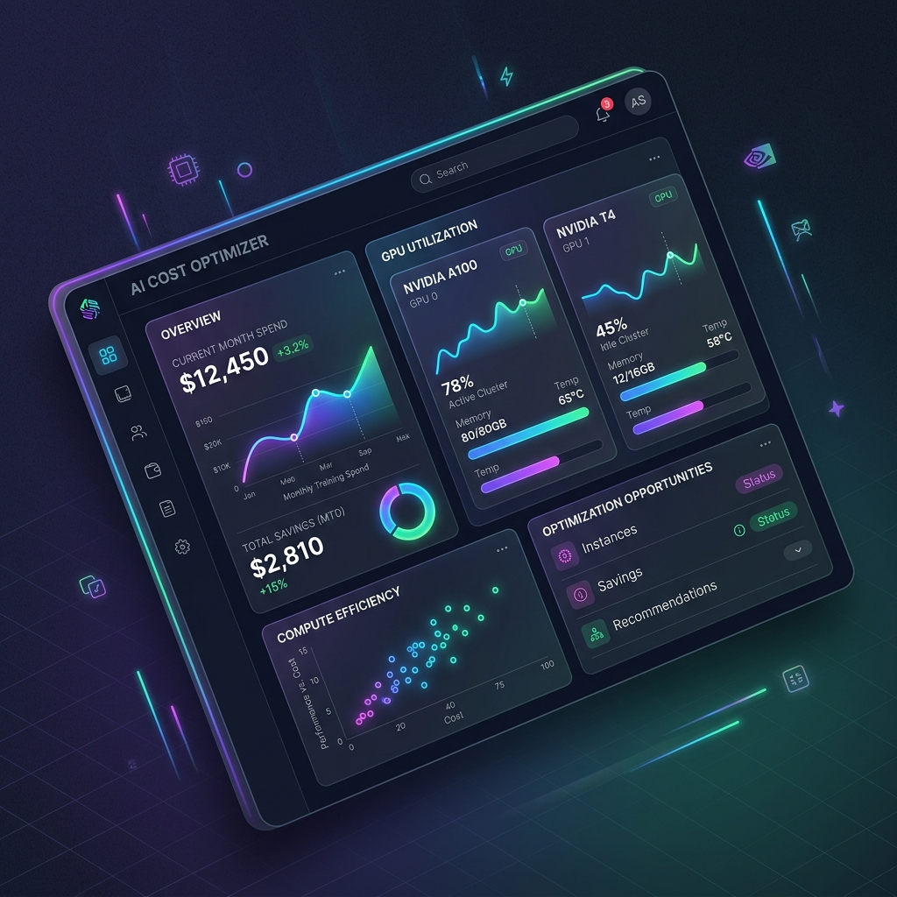

# 🌌 Multi-Disciplinary Engineering & AI Workspace

Welcome to the **Multi-Disciplinary Engineering & AI Workspace**. This repository serves as a centralized hub for advanced, high-performance projects bridging machine learning, cloud infrastructure orchestration, hardware simulations, and responsive full-stack applications.

---

## 🚀 Flagship Project: Cost-Aware AI Training Optimizer

Our primary featured application in this workspace is the **Cost-Aware AI Training Infrastructure Optimization System**, located in the [`cost-aware-ai-training/`](cost-aware-ai-training/) subdirectory.



This project leverages live-scraped AWS spot instance prices and Scikit-Learn Random Forest Regressor models to analyze deep learning parameters and predict execution costs. It automatically calculates and suggests the most cost-effective hardware configurations (comparing NVIDIA A100 vs T4 GPUs) and cloud routing modalities (IaaS vs PaaS vs SaaS).

### ⚡ Key Features:
* **🧠 Machine Learning Regression Core:** Trained on dataset sizing, batch sizes, epochs, and model weights to predict resource duration and costs.
* **📈 Real-Time Dashboards:** Interactive visualization mapping simulated GPU/CPU workloads, cluster memory utilization, and Prometheus scrape telemetry.
* **🌱 Sustainable Engineering:** Tracks and displays monthly budget cap consumption, dollar savings, and carbon footprints offset through smart model routing.

👉 **[Go to Project README](cost-aware-ai-training/README.md) for detailed setup, execution, and local run instructions.**

---

## 📂 Workspace Structure

| Project Directory | Category | Stack / Technologies | Description |
| :--- | :--- | :--- | :--- |
| 💸 [**`cost-aware-ai-training/`**](cost-aware-ai-training/) | Machine Learning & Cloud Ops | React, Vite, FastAPI, Scikit-Learn, SQLite | AI training optimizer, spot price tracker, and system resources monitor. |

---

## 🛠️ Quick Start (Flagship System)

To quickly spin up the cost optimization dashboard:

### 1. Launch the Backend API
```bash
cd cost-aware-ai-training/backend
# Activate your python virtual environment
.\venv\Scripts\activate   # Windows
source venv/bin/activate  # macOS/Linux

# Install requirements & start FastAPI server
pip install -r requirements.txt
uvicorn main:app --reload --port 8000
```

### 2. Launch the React Dashboard UI
```bash
cd cost-aware-ai-training/frontend
# Install dependencies & run Vite dev server
npm install
npm run dev
```
Open **`http://localhost:5173`** in your browser to view the platform!

---

## 📈 Future Roadmaps & Integrations
- **🚢 Multi-Node Kubernetes Scaling:** Standardize configuration templates for actual container orchestration.
- **⚡ CoreML/TensorRT Quantization:** Support cost predictions for models compiled with hardware-specific optimizations.
- **🛡️ Multi-Cloud Integrations:** Scraping APIs for Google Cloud (GCP) and Azure instance cost differences.
